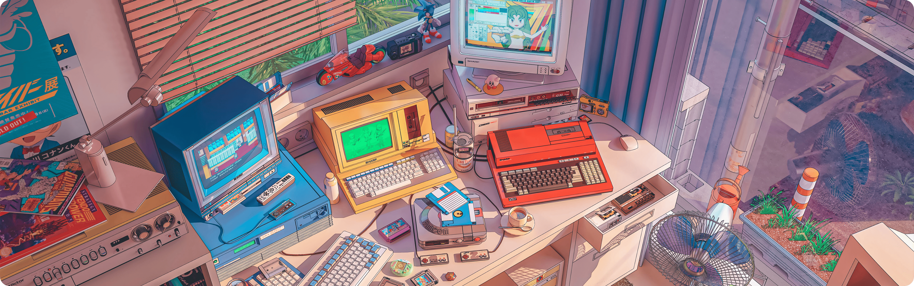
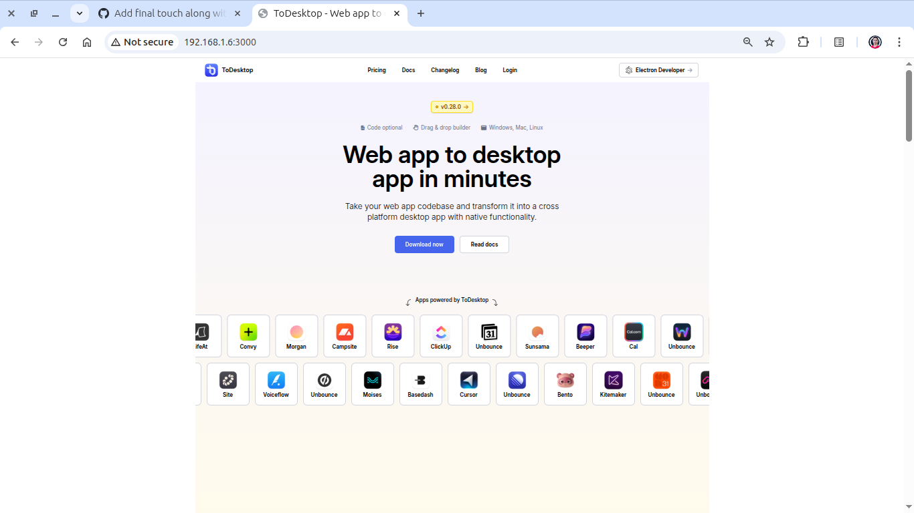
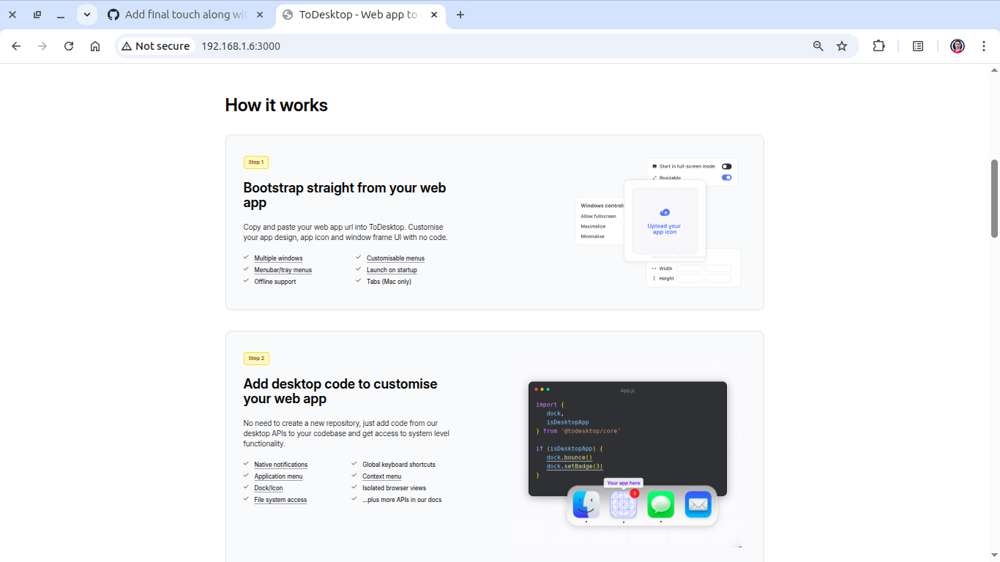
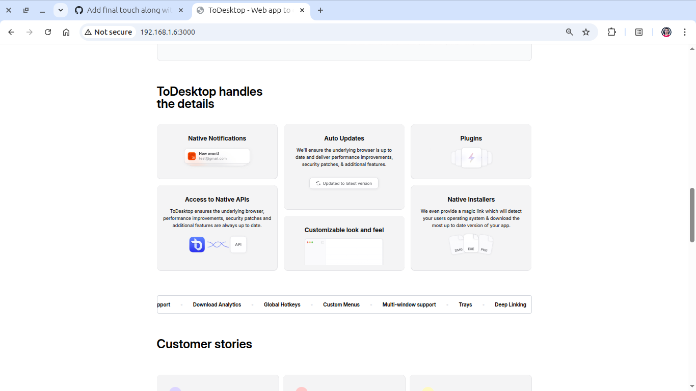
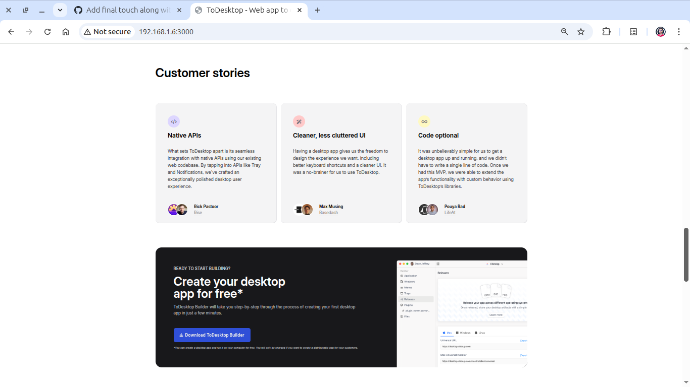
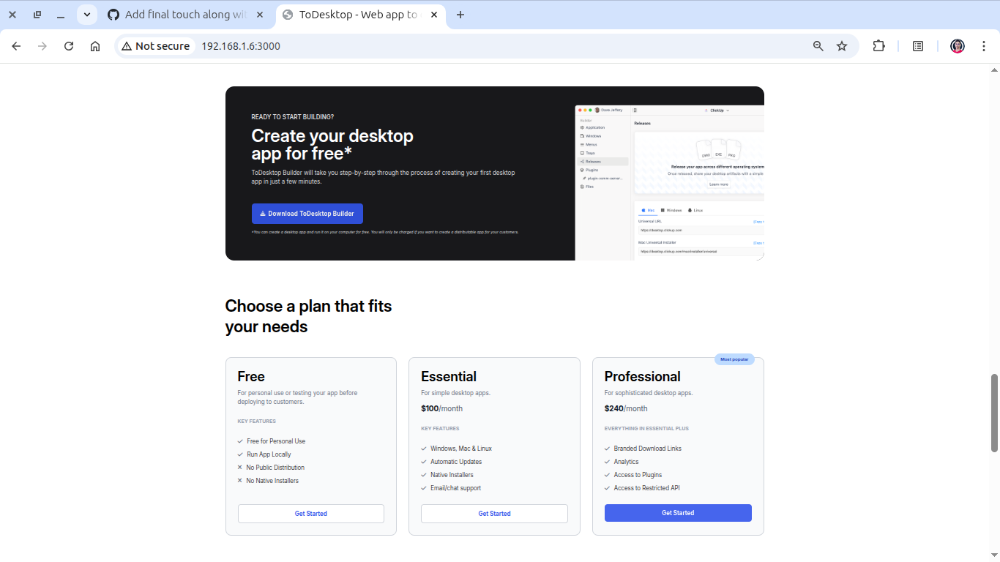
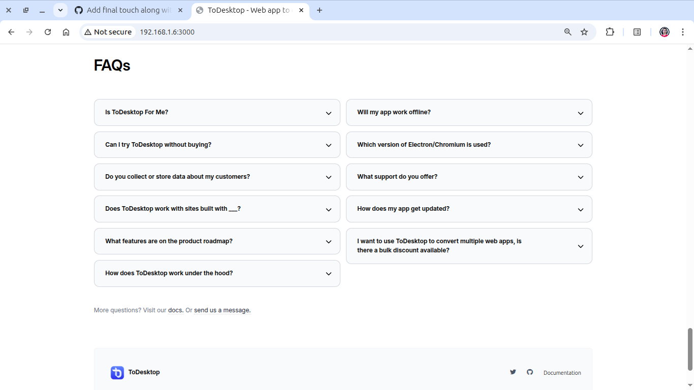

# ToDesktop - Tailwind Practice Project



### 🚨 Deployment: [View Live](https://iammihirsig.github.io/ToDesktop)

## 📑 Table of Contents

- [What Is This Project About](#what-is-this-project-about)
- [Why This Project Matters](#why-this-project-matters)
- [A Little Journey of This Project](#a-little-journey-of-this-project)
- [Screenshots](#screenshots)
- [Tech Stack](#tech-stack)
- [Folder Structure (Setup Guide)](#folder-structure-setup-guide)
- [Some Resources to Learn Tailwind](#some-resources-to-learn-tailwind)
- [Contributing Guidelines](#contributing-guidelines)
- [License](#license)
- [Final Note](#final-note)

---

## What Is This Project About

This project is a **landing page clone of the ToDesktop website**, built using **HTML, Tailwind CSS, and a bit of JavaScript**. It is part of my **[Self-Driven MERN Stack Internship](https://github.com/iammihirsig/Self-Driven-MERN-Stack-Internship)**.

> 💡 _The goal was to test and implement concepts I learned in Tailwind through a real-world, industry-level layout. This marks a milestone in my ability to design and build UI like a professional frontend developer._

---

## Why This Project Matters

- 🏗️ First project where I **followed full GitHub project standards**:
  - Created and assigned **issues**
  - Used **labels** and **branches**
  - Made **pull requests**, **merged**, and managed **commits**
- 🚀 Practiced:
  - **Deployment**
  - **Branching workflow**
  - **Consistent UI development**
- 📌 Reflects my **real-world understanding of frontend workflows** — far beyond just theory.

> ⚙️ _This project is proof of execution, not just learning._

---

## A Little Journey of This Project

- **Started:** 22nd June 2025
- **Finished:** 6th July 2025

> ⏳ _I committed ~3 hours per day consistently._

- Faced **time management challenges**
- On some days, made just **1–2 commits**, but they were **high quality**
- Learned the **value of consistency over quantity**
- Strengthened my **focus and discipline**

---

## Screenshots








---

## Tech Stack

- **HTML5**
- **Tailwind CSS**
- **Vanilla JavaScript**
- **Git + GitHub**
- **Deployed on GitHub Pages**

---

## Folder Structure (Setup Guide)

```bash
TODESKTOP/
├── assets/
│   └── images/           # All image assets used
├── node_modules/         # Installed dependencies (if any)
├── src/
│   ├── css/
│   │   ├── index.css
│   │   └── style.css
│   └── js/
│       └── script.js
├── .gitignore
├── .prettierrc
├── LICENSE
├── index.html
├── package.json
├── package-lock.json
└── Readme.md
```

---

## Run Locally

You can simply open the `index.html` file in a browser or use Live Server.

> [!IMPORTANT]
> make sure to do `npm install` from root directory to install all dependencies.


```bash
# Clone the repository
git clone https://github.com/iammihirsig/ToDesktop.git
cd ToDesktop

# Open index.html in browser
# OR
# Use Live Preview if you're using VS Code
```

---

## Some Resources to Learn Tailwind

> 🔥 These are the exact ones I used while building this project:

- 📘 [Official Tailwind CSS Docs](https://tailwindcss.com/docs)
- 🌐 [CheatSheet](https://tailwindcss.504b.cc)

> [!TIP]
> Don’t just copy-paste Tailwind classes — understand what each one does.\_

---

## Contributing Guidelines

> [!IMPORTANT]
> Humbly, I am not looking for contributors on this project.

But you're welcome to:

- 🧪 **Fork this repository**
- 🛠️ **Practice your skills**
- 🧠 **Use this repo structure to learn how to manage a frontend project professionally**

> [!CAUTION]
> Please avoid unnecessary pull requests. This project is complete and intended as a personal learning milestone.

---

## License

This project is licensed under the **MIT License**.
See the [LICENSE](./LICENSE) file for full details.

---

## Final Note

> 🌱 This project helped me **grow from a learner to a builder**.

From managing a GitHub repository, to building and deploying a fully functional UI, and learning how to show up daily — it has taught me way more than just writing HTML and CSS.

> 🧠 It’s not just about _how to code_, but about _how to think and work like a developer._

---

**Made with 💙 by [Mihir Raj Singh | @iammihirsig](https://github.com/iammihirsig)**
